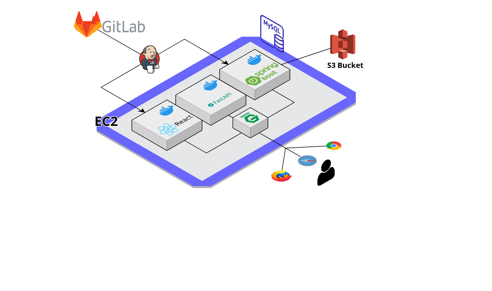

# OneSongHere  - 너와 나의 작곡 플랫폼

### 프로젝트 진행 기간

2023.04.10(월) ~ 2023.05.19(금)

## Team Members

<div align="left">
  <table>
    <tr>
        <td align="center">
        <a href="">
          
        </a>
      </td>
      <td align="center">
        <a href="">
          
        </a>
      </td>
      <td align="center">
        <a href="">
          
        </a>
      </td>
      <td align="center">
        <a href="">
          
        </a>
      </td>
      <td align="center">
        <a href="">
          
        </a>
      </td>
    </tr>
    <tr>
      <td align="center">
        <a href="https://github.com/Woong1201/">
          김영웅
        </a>
      </td>
      <td align="center">
        <a href="https://github.com/variety82">
          김창현
        </a>
      </td>
      <td align="center">
        <a href="https://github.com/taeyeon721">
          김태연
        </a>
      </td>
      <td align="center">
        <a href="https://github.com/SSH1007">
          신선호
        </a>
      </td>
      <td align="center">
        <a href="https://github.com/ldhldh07">
          임두현
        </a>
      </td>
    </tr>
  </table>
</div>


## 🎶등장 배경


#### "세상에 오직 하나 뿐인 당신만의 음악을 완성하세요!"

## 개요


## Usage

````
git clone https://lab.ssafy.com/s08-final/S08P31A808.git

이후 exec폴더의 포팅메뉴얼을 따라 진행
````


### 개발환경


## Service Architecture



### 📂디렉토리 구조

<details>
  <summary>
  백엔드 디렉토리 구조(Java)
  </summary>


    ├─java
    │  └─com
    │      └─ownsong
    │          ├─api
    │          │  ├─album
    │          │  │  ├─controller
    │          │  │  ├─dto
    │          │  │  │  ├─request
    │          │  │  │  └─response
    │          │  │  ├─entity
    │          │  │  ├─repository
    │          │  │  └─service
    │          │  ├─board
    │          │  │  ├─controller
    │          │  │  ├─dto
    │          │  │  │  ├─request
    │          │  │  │  └─response
    │          │  │  ├─entity
    │          │  │  ├─repository
    │          │  │  └─service
    │          │  ├─notification
    │          │  │  └─entity
    │          │  ├─relayStudio
    │          │  │  ├─controller
    │          │  │  ├─dto
    │          │  │  │  ├─request
    │          │  │  │  └─response
    │          │  │  ├─entity
    │          │  │  ├─repository
    │          │  │  └─service
    │          │  ├─sheet
    │          │  │  ├─entity
    │          │  │  └─repository
    │          │  ├─studio
    │          │  │  ├─controller
    │          │  │  ├─dto
    │          │  │  │  ├─request
    │          │  │  │  └─responese
    │          │  │  ├─entity
    │          │  │  ├─repository
    │          │  │  └─service
    │          │  └─user
    │          │      ├─controller
    │          │      ├─dto
    │          │      │  └─response
    │          │      ├─entity
    │          │      ├─repository
    │          │      ├─service
    │          │      └─social
    │          ├─common
    │          │    ├─CorsFilter
    │          │    └─LoginIntercepter
    │          ├─config
    │          │     ├─QueryDslConfig
    │          │     ├─S3Config
    │          │     ├─SwaggerConfig
    │          │     └─WebMvcConfig
    │          │
    │          └─exception
    │                ├─BusinessException
    │                ├─ErroCode
    │                ├─ErrorResponse
    │                └─GlobalExceptionHandler
    └─resources
        ├─static
        ├─application.yml
        └─templates

 </details>

###

<details>
  <summary>
  백엔드 디렉토리 구조(Python)
  </summary>


    ├─service
    │   ├─chatgpt.py
    │   ├─cover_service.py
    │   ├─s3_service.py
    ├─app.py
    ├─requirements.txt
    └─schema.py

 </details>

<details>
  <summary>
  프론트엔드 디렉토리 구조
  </summary>


    temp

 </details>

## 주요기능 및 화면

#### 로그인 & 로그아웃(구글OAuth)

- 우측 상단에 로그인 버튼을 누른 후 소셜 로그인을 진행할 수 있습니다
- 로그인을 한 사용자만 서비스를 이용하기 위한 스튜디오를 생성할 수 있습니다.

#### 릴레이 스튜디오(작곡)

#### 작품 공유 게시판

#### 커뮤니티 게시판

 