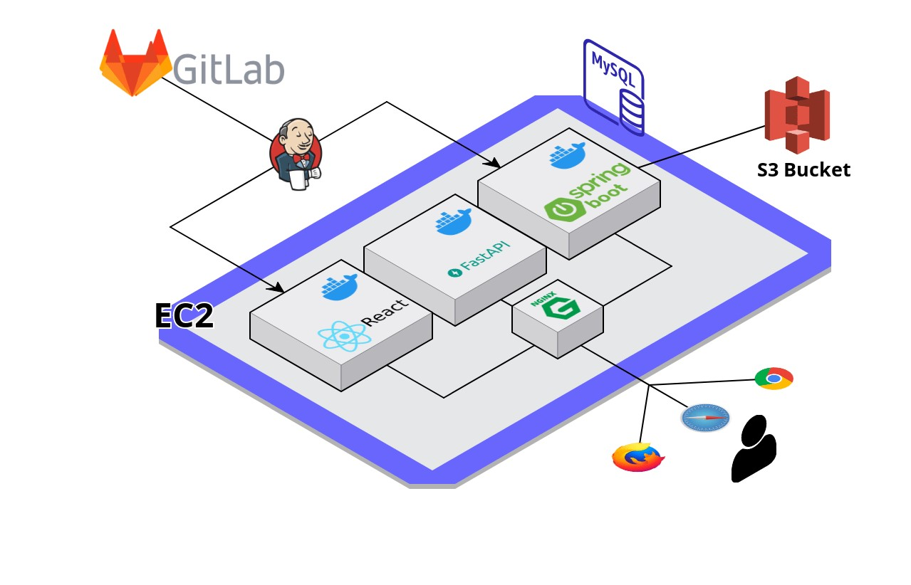
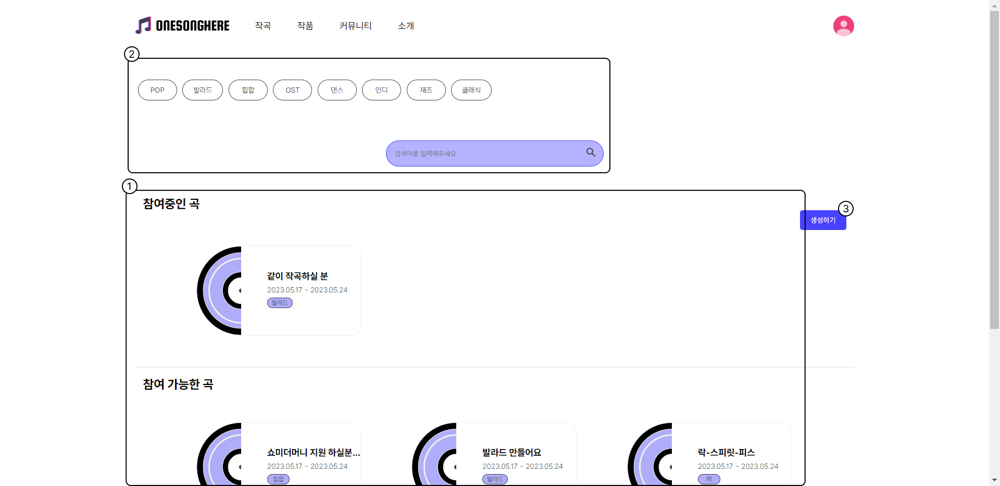
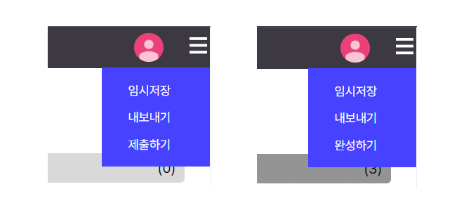
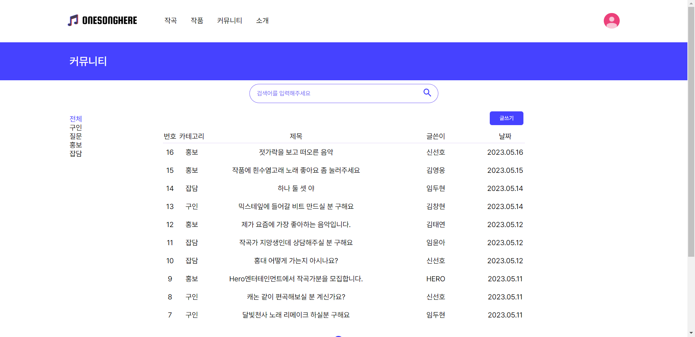

# OneSongHere  - 너와 나의 작곡 플랫폼

### 프로젝트 진행 기간

2023.04.10(월) ~ 2023.05.19(금)

## Team Members

<div align="left">
  <table>
    <tr>
        <td align="center">
        <a href="">
          
        </a>
      </td>
      <td align="center">
        <a href="">
          
        </a>
      </td>
      <td align="center">
        <a href="">
          
        </a>
      </td>
      <td align="center">
        <a href="">
          
        </a>
      </td>
      <td align="center">
        <a href="">
          
        </a>
      </td>
    </tr>
    <tr>
      <td align="center">
        <a href="https://github.com/Woong1201/">
          김영웅
        </a>
      </td>
      <td align="center">
        <a href="https://github.com/variety82">
          김창현
        </a>
      </td>
      <td align="center">
        <a href="https://github.com/taeyeon721">
          김태연
        </a>
      </td>
      <td align="center">
        <a href="https://github.com/SSH1007">
          신선호
        </a>
      </td>
      <td align="center">
        <a href="https://github.com/ldhldh07">
          임두현
        </a>
      </td>
    </tr>
  </table>
</div>


## 🎶등장 배경

콧노래를 흥얼거리거나 휘파람을 부는 등 음악은 우리의 삶에 뗄레야 뗄 수가 없는 존재입니다.

자유자재로 연주를 하는 음악인, 즉석에서 작곡을 하는 가수들을 보며 나도 저렇게 해보고싶다는 생각을 해보신적이 있으신가요?

작곡은 오랜 기간 동안 전문가들의 전유물로만 여겨질 정도로 진입장벽이 높습니다. 

이에, OneSongHere는 누구나 간편하게 작곡을 체험해볼 수 있게 하기 위해 등장하였습니다.

#### 

## 개요

`OneSongHere`는 여기에 모여 함께 하나의 음악을 만들자라는 뜻을 가진 작곡 플랫폼입니다.

진입장벽이 높은 작곡이라는 영역을 보다 간단한 조작으로 체험해볼 수 있으며,  다른 사람들과 멜로디를 합쳐가며 나만의 작품을 만들 수 있습니다. 

#### "다른 사람들과 머리를 맞대며 세상에 오직 하나뿐인 우리만의 음악을 완성하세요!"

## Usage

````
git clone https://lab.ssafy.com/s08-final/S08P31A808.git

이후 exec폴더의 포팅메뉴얼을 따라 진행
````


### 개발환경


## Service Architecture



### 📂디렉토리 구조

<details>
  <summary>
  백엔드 디렉토리 구조(Java)
  </summary>


    ├─java
    │  └─com
    │      └─ownsong
    │          ├─api
    │          │  ├─album
    │          │  │  ├─controller
    │          │  │  ├─dto
    │          │  │  │  ├─request
    │          │  │  │  └─response
    │          │  │  ├─entity
    │          │  │  ├─repository
    │          │  │  └─service
    │          │  ├─board
    │          │  │  ├─controller
    │          │  │  ├─dto
    │          │  │  │  ├─request
    │          │  │  │  └─response
    │          │  │  ├─entity
    │          │  │  ├─repository
    │          │  │  └─service
    │          │  ├─notification
    │          │  │  └─entity
    │          │  ├─relayStudio
    │          │  │  ├─controller
    │          │  │  ├─dto
    │          │  │  │  ├─request
    │          │  │  │  └─response
    │          │  │  ├─entity
    │          │  │  ├─repository
    │          │  │  └─service
    │          │  ├─sheet
    │          │  │  ├─entity
    │          │  │  └─repository
    │          │  ├─studio
    │          │  │  ├─controller
    │          │  │  ├─dto
    │          │  │  │  ├─request
    │          │  │  │  └─responese
    │          │  │  ├─entity
    │          │  │  ├─repository
    │          │  │  └─service
    │          │  └─user
    │          │      ├─controller
    │          │      ├─dto
    │          │      │  └─response
    │          │      ├─entity
    │          │      ├─repository
    │          │      ├─service
    │          │      └─social
    │          ├─common
    │          │    ├─CorsFilter
    │          │    └─LoginIntercepter
    │          ├─config
    │          │     ├─QueryDslConfig
    │          │     ├─S3Config
    │          │     ├─SwaggerConfig
    │          │     └─WebMvcConfig
    │          │
    │          └─exception
    │                ├─BusinessException
    │                ├─ErroCode
    │                ├─ErrorResponse
    │                └─GlobalExceptionHandler
    └─resources
        ├─static
        ├─application.yml
        └─templates

 </details>

###

<details>
  <summary>
  백엔드 디렉토리 구조(Python)
  </summary>


    ├─service
    │   ├─chatgpt.py
    │   ├─cover_service.py
    │   ├─s3_service.py
    ├─app.py
    ├─requirements.txt
    └─schema.py

 </details>

<details>
  <summary>
  프론트엔드 디렉토리 구조
  </summary>


    src
    ├─assets
    │  ├─fonts
    │  │  └─Pretendard
    │  │      ├─woff
    │  │      ├─woff-subset
    │  │      ├─woff2
    │  │      └─woff2-subset
    │  └─images
    │      ├─guide
    │      ├─icon
    │      └─record
    ├─components
    │  ├─atoms
    │  │  ├─albumimage
    │  │  ├─buttons
    │  │  ├─common
    │  │  ├─dropdown
    │  │  ├─examplecard
    │  │  ├─gifbox
    │  │  ├─guide
    │  │  ├─halloffame
    │  │  ├─inputs
    │  │  ├─likeheart
    │  │  ├─mainbanner
    │  │  ├─profile
    │  │  ├─profiledropdown
    │  │  ├─studiocard
    │  │  ├─studiochord
    │  │  ├─studioheader
    │  │  ├─studionote
    │  │  ├─studiotab
    │  │  └─transparencytext
    │  ├─molecules
    │  │  ├─albumcard
    │  │  ├─articleheader
    │  │  ├─articleline
    │  │  ├─commentinput
    │  │  ├─commentline
    │  │  ├─common
    │  │  ├─footer
    │  │  ├─guidemenu
    │  │  ├─header
    │  │  ├─mainbody
    │  │  ├─profilesection
    │  │  ├─searchsection
    │  │  ├─studiochord
    │  │  ├─studioheader
    │  │  ├─studioinstrument
    │  │  ├─studiolist
    │  │  └─studionote
    │  ├─organisms
    │  │  ├─albums
    │  │  │  └─albumcards
    │  │  ├─board
    │  │  ├─common
    │  │  ├─main
    │  │  ├─modal
    │  │  ├─searchsection
    │  │  ├─studio
    │  │  ├─studiolist
    │  │  ├─vote
    │  │  └─writeframe
    │  └─templates
    │      ├─relaystudio
    │      └─studio
    ├─pages
    ├─router
    ├─services
    ├─store
    ├─stories
    │  └─assets
    ├─styles
    ├─types
    └─utils

 </details>


##  서비스 소개

#### 릴레이 작곡😎? 그게 무엇인가요

릴레이 작곡은 여러 참여자들이 순차적으로 자신의 음악적 아이디어를 추가해가며 하나의 곡을 완성하는 방식입니다.

 각 참여자는 한 명당 설정된 길이만큼의 음악을 작곡하고, 다음 참여자는 그것을 이어받아 추가로 작곡합니다. 

마치 릴레이처럼 참여자 간에 음악이 이어진다고 할 수 있습니다.


#### 어떻게 사용하나요❓

- 작곡 페이지: 참여중인 프로젝트와 참여할 수 있는 다양한 프로젝트를 보여줍니다. 원하는 프로젝트가 없다면, '생성하기'를 통해 자신만의 새로운 작곡 스튜디오를 만들 수 있습니다.
- 스튜디오 페이지: 피아노와 드럼의 소리를 활용하여 창작에 임할 수 있습니다. 입력 방식은 클릭 또는 키보드 입력을 통해 가능하며, '임시저장', '제출하기', '완성하기' 기능을 통해 작곡 과정을 관리할 수 있습니다.
- 커뮤니티: 구인, 질문, 홍보, 잡담 등 다양한 카테고리로 나누어져 있어, 사용자들끼리 소통하고 정보를 공유할 수 있습니다.
- 작품 페이지: 완성된 앨범들을 확인하고, 앨범을 재생하거나 좋아요를 누를 수 있습니다. 가장 인기있는 앨범은 '명예의 전당'에 등록됩니다.

#### 다양한 사람들과 함께 창작하고 공유하는 즐거움을 느껴보세요🔅

이제 릴레이 작곡 웹 서비스를 통해 다양한 사람들과 함께 창작하고, 그 즐거움을 나눠보세요. 

여러분의 아이디어가 하나의 멋진 음악으로 탄생하는 그 순간을 기대합니다!

### 작곡🎼




메인 페이지에서는 작곡 페이지로 이동할 수 있고 아래와 같은 기능을 사용할 수 있습니다.

1. 참여중인 프로젝트와 참여할 수 있는 다양한 프로젝트를 보여줍니다.
2. 페이지 내 태그 버튼이나 검색어를 통해 원하는 프로젝트를 쉽게 찾을 수 있는 필터링 기능을 제공합니다.
3. '생성하기' 버튼을 통해 자신만의 새로운 스튜디오를 생성할 수 있습니다. 스튜디오 생성 시 제목, 장르, 참여 인원 제한, 한 명당 작곡 가능한 길이 등을 조절할 수 있습니다.


### 스튜디오🙍🏻‍♂️🙍🏻‍♀️


스튜디오 페이지에서는 아래와 같은 경험들을 할 수 있습니다.

1. 피아노와 드럼의 소리를 조합하여 곡을 작곡할 수 있으며 클릭이나 키보드 입력으로 노트를 입력할 수 있습니다. 편집할 수 있는 부분은 밝은 색으로 표시됩니다.
2. 코드 버튼을 통해 다양한 코드를 사용할 수 있어 작곡에 익숙치 않은 사용자도 쉽게 작곡에 참여할 수 있습니다. 자신이 편집한 부분을 들어볼 수 있습니다.
3. 참여자들이 투표하여 작업물이 곡에 포함될지를 결정합니다.
4. 지금까지의 작업물과 자신이 편집한 부분을 들어볼 수 있습니다.



'임시저장' 기능을 통해 현재까지의 작업을 임시로 저장할 수 있습니다.

'제출하기'를 통해 자신의 작업물을 제출하면, 투표가 진행됩니다.

'완성하기' 버튼을 클릭한 후 앨범의 제목, 내용, 장르를 입력하면 세상에 하나뿐인 나만의 앨범이 완성됩니다.


### 작품💿

작품 페이지에서는 다양한 앨범들을 확인할 수 있습니다.


앨범 커버에 마우스를 올리면 재생 버튼이 나타나며, 이를 클릭하여 곡을 재생할 수 있습니다. 

사용자는 자신이 좋아하는 앨범에 '좋아요'를 표시할 수 있습니다.


가장 많은 '좋아요'를 받은 상위 3개 앨범은 '명예의 전당'에 등록되어 다른 사용자들에게 추천됩니다.

### 커뮤니티📢



커뮤니티는 구인, 질문, 잡담 등 다양한 카테고리로 나누어져 있습니다.

사용자는 각 카테고리에 맞는 글을 작성하거나 다른 사용자의 글에 응답할 수 있습니다.