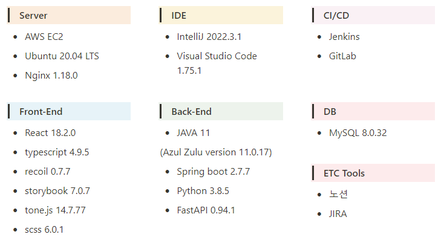

# 포팅 메뉴얼


## 목차

1. 환경설정 및 빌드 & 배포
2. 외부 서비스 문서
3. 시연시나리오


## 1. 환경설정 및 빌드&배포


### 개발환경




### Docker 설치

### Set up the repository

1. Update the `apt` package index and install packages to allow `apt` to use a repository over HTTPS:

```
 $ sudo apt-get update
 $ sudo apt-get install \
    ca-certificates \
    curl \
    gnupg \
    lsb-release
```

1. Add Docker's official GPG key

```
 $ sudo mkdir -m 0755 -p /etc/apt/keyrings
 $ curl -fsSL https://download.docker.com/linux/ubuntu/gpg | sudo gpg --dearmor -o
 /etc/apt/keyrings/docker.gpg
```

1. Use the following command to set up the repository

```
$ echo \
  "deb [arch=$(dpkg --print-architecture) signed-by=/etc/apt/keyrings/docker.gpg] https://download.docker.com/linux/ubuntu \
  $(lsb_release -cs) stable" | sudo tee /etc/apt/sources.list.d/docker.list > /dev/null
```

### Install Docker Engine

1. Update the apt package index

```
$ sudo apt-get update
```

1. Install Docker Engine, containerd, and Docker Compose

```
$ sudo apt-get install docker-ce docker-ce-cli containerd.io docker-buildx-plugin docker-compose-plugin
```


### MySQL 설치

### Install MySQL

```
$ sudo apt install mysql-server
$ sudo mysql -u root -p
$ CREATE USER '아이디'@‘%' identified with mysql_native_password by '비밀번호';
$ FLUSH PRIVILEGES;
$ create database etjude;
$ use hero_db;
GRANT ALL PRIVILEGES ON etjude.* to ‘아이디'@‘%';
```


### 외부 접속 허용

```
$ sudo vi /etc/mysql/mysql.conf.d/mysqld.cnf
bind-address값을 0.0.0.0 으로 수정

// 0.0.0.0은 모두 허용임 적절히 수정
$ sudo servie mysql restart
```


### Nginx 설치

```jsx
$ sudo apt-get install nginx
```


### **Encrypt(SSL 발급)**

```jsx
$ sudo apt-get install letsencrypt
$ sudo letsencrypt certonly --standalone -d [도메인]
```


### Nginx 설정

```jsx
$ cd /etc/nginx/sites-enabled
내부의 default 설정

server{
   location / {
            proxy_pass http://localhost:3000;
    }
    location /api {
            proxy_pass http://localhost:8080/api;
    }
    location /ai-api{
            proxy_pass http://localhost:8081/ai-api/v1;
    }

    listen 443 ssl;
    ssl_certificate /etc/letsencrypt/live/도메인/fullchain.pem;
    ssl_certificate_key /etc/letsencrypt/live/도메인/privkey.pem;
    }
server {

    if ($host = 도메인) {
        return 301 https://$server_name$request_uri;
    }
        listen 80;
        server_name 도메인;
    return 404;
}
```


### 환경변수 형태

```jsx
---------Spring------------
application.yml 내 환경변수 설정

src/main/resources내의 application.yml파일과 같은 위치에 아래 파일을 생성

# MySQL(application-db.yml으로 생성) & OAuath
spring:
  datasource: 
    url: jdbc:mysql://{도메인주소}:3306/{db_name}?useUnicode=true&serverTimezone=Asia/Seoul
    username: {user_name}
    password: {user_pw}
    driver-class-name: com.mysql.cj.jdbc.Driver
  OAuth2:
    google:
      url : https://accounts.google.com/o/oauth2/v2/auth
      client-id : 발급받은 client id
      client-secret : 발급받은 client secret
      response-type : code
      callback-url : https://{도메인}/login/google
      scope : https://www.googleapis.com/auth/userinfo.profile https://www.googleapis.com/auth/userinfo.email
# aws-s3
cloud:
  aws:
    credentials:
      accessKey: 발급받은 accessKey
      secretKey: 발급받은 secretKey
    s3:
      bucket: 설정한 버킷명
    region:
      static: 설정한 지역


----------Python-------------
.env 내 환경변수 설정

aws_access_key_id=발급받은 access_key,
aws_secret_access_key=발급 받은 secret_access_key
region_name=설정한 지역명,
bucket_name=설정한 버킷명,
REST_API_KEY=카카오RESTAPI_KEY,
OPENAI_API_KEY=발급받은OPENAI_API_KEY


-------Front-End------------
#.env

REACT_APP_GOOGLE_CLIENT_ID=발급받은 client id
REACT_APP_URI=https://{도메인}
```


### Ignore 파일 및 생성파일 위치

- Spring : application-{db & s3}.yml (main/resources 아래에 위치)
- FastAPI: .env (최상단 디렉토리)
- React: ./env (최상단 디렉토리)


## 빌드 및 배포

### 프론트엔드 빌드

```jsx
build -t DockerHubID/DockerHubRepo:fe-latest .
```


### 백엔드 빌드

```jsx
# 스프링 빌드
Mac => ./gradlew clean build 후 ./gradlew build 진행
Windows => ./gradlew.bat clean build 후 ./gradlew.bat build 진행

build -t DockerHubID/DockerHubRepo:be-latest .

# 파이썬 빌드
build -t DockerHubID/DockerHubRepo:fastapi-latest .
```

### 백엔드 배포

```jsx
백엔드의 이미지를 풀 받은 후 컨테이너 실행
docker pull DockerHubID/DockerHubRepo:해당tag

# 백엔드(스프링)
docekr run --rm -d -p 8080:8080 --name be-latest 이미지ID
# 백엔드(FastAPI)
docekr run --rm -d -p 8081:8081 --name fastapi-latest 이미지ID
# 프론트엔드
docekr run --rm -d -p 3000:80 --name fe-latest 이미지ID

컨테이너 확인 : docker ps
```


## 2. 외부 서비스 문서

### OAuth

1. [https://console.cloud.google.com/apis](https://console.cloud.google.com/apis/dashboard) 이동후 google 로그인
2. 서비스 동의 후 프로젝트 만들기
    1. OAuth 동의 화면 (앱 정보, 앱 로고, 앱 도메인, 승인된 도메인, 개발자 연락처)
    2. 범위 설정
    3. 테스트 사용자 설정
3. 사용자 인증 정보 만들기
    1. OAuth 클라이언트 ID 만들기 (웹 어플리케이션)
    2. 이름 설정
    3. 승인된 자바스크립트 원본 (80 외의 포트를 사용하는 HTTP 원본)
    4. 승인된 리디렉션 URI
4. 이후 얻은 클라이언트 ID, password 를 통해 환경설정
    1. 백엔드 환경설정
        
        ```
        OAuth2:
            google:
              url : https://accounts.google.com/o/oauth2/v2/auth
              client-id : 발급받은 client id
              client-secret : 발급받은 client secret
              response-type : code
              callback-url : https://{도메인}/login/google
              scope : https://www.googleapis.com/auth/userinfo.profile https://www.googleapis.com/auth/userinfo.email
        ```
        
    2. 프론트엔드 환경설정
        
        ```
        REACT_APP_GOOGLE_CLIENT_ID=발급받은 client id
        REACT_APP_URI=https://{도메인}
        ```
        


### KAKAO Karol

1. https://developers.kakao.com/product/karlo 이동후 kakao 로그인
2. 애플리케이션 추가(앱 이름 입력)
3. REST API키 저장 후 환경변수 설정

### OPEN API

1. https://platform.openai.com/ 접속후 우측 상단 프로필 -> View API Keys
2. create new secret key 발급 후 환경변수 설정


### AWS - S3

1. https://www.aws.amazon.com/ 에 가입 후 S3로 이동
2. 프로젝트에 사용할 버킷을 생성
3. 버킷 이름, 리전, 퍼블릭 액세스 설정
4. IAM 에서 사용자 생성 후 AmazonS3FullAccess 권한 부여
5. 생성한 사용자의 AccessKey와 SecretKey를 발급 받고 프로젝트에 적용

### AWS S3 Bucket 설정

1. 버킷 정책

   ```json
   {
       "Version": "2012-10-17",
       "Statement": [
           {
               "Sid": "PublicReadGetObject",
               "Effect": "Allow",
               "Principal": "*",
               "Action": "s3:GetObject",
               "Resource": "arn:aws:s3:::s3ffmpegtest/*"
           }
       ]
   }
   ```

2. ACL

   - 버킷 소유자
     - 객체 : 나열, 쓰기, 읽기
     - 버킷 ACL : 읽기, 쓰기
   - 버킷 소유자
     - 객체 : 읽기
     - 버킷 ACL : 읽기

3. CORS

   ```json
   [
       {
           "AllowedHeaders": [
               "*"
           ],
           "AllowedMethods": [
               "HEAD",
               "GET",
               "PUT",
               "POST",
               "DELETE"
           ],
           "AllowedOrigins": [
               "*"
           ],
           "ExposeHeaders": [
               "ETag",
               "x-amz-meta-custom-header"
           ]
       }
   ]
   ```

   

## 3. 시연 시나리오

### 소셜 로그인(로그인 & 로그아웃(구글OAuth))

- 로그인 버튼을 누른 후 소셜 로그인을 진행할 수 있습니다.
- 현재 소셜 로그인은 구글 계정으로만 가능합니다.
- 로그인 완료 시, 자동으로 홈 화면으로 이동합니다.
